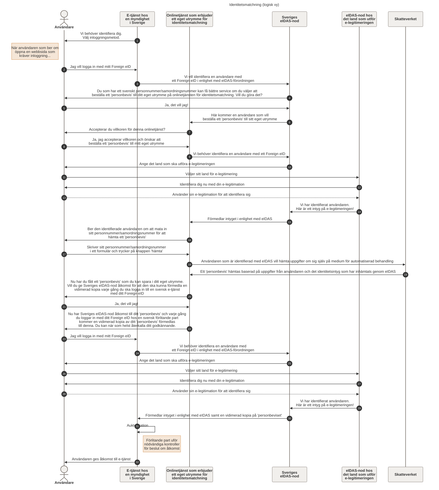

## Stöd i eget utrymme för matchning
Konceptuell modell

```mermaid
%%{init: {'sequence': { 'mirrorActors': true, 'rightAngles': true, 'messageAlign': 'center', 'actorFontWeight': 900, 'actorFontSize': 18, 'noteFontWeight': 100, 'noteFontSize': 12}}}%%
%%{init: {'theme': 'base', 'themeVariables': {'labelBoxBkgColor': '#F5F5F4', 'labelBoxBorderColor': '#998980', 'actorBorder': '#696059', 'actorBkg': '#F1EFEC', 'activationBorderColor': '#CD796E', 'activationBkgColor': '#CD796E', 'noteBkgColor': '#F5E6D7', 'noteBorderColor': '#CE8036'}}}%%


sequenceDiagram
    autonumber
    title: Identitetsmatchning (logisk vy)    
    actor U as Användare
    participant RP as E-tjänst hos<br />en myndighet<br />i Sverige
    participant IDM as Onlinetjänst som erbjuder<br />ett eget utrymme för<br />identitetsmatchning
    participant N as Sveriges<br />eIDAS-nod
    participant eID as eIDAS-nod hos<br />det land som utför<br />e-legitimeringen
    participant SV as Skatteverket
    RP->>U: Vi behöver identifiera dig.<br />Välj inloggningsmetod.
    Note left of U: När användaren som ber om<br />öppna en webbsida som<br />kräver inloggning...
    U->>RP: Jag vill logga in med mitt Foreign eID
    RP->>N: Vi vill identifiera en användare med<br />ett Foreign eID i enlighet med eIDAS-förordningen
    N->>U: Du som har ett svenskt personnummer/samordningsnummer kan få bättre service om du väljer att<br />beställa ett 'personbevis' till ditt eget utrymme på onlinetjänsten för identitetsmatchning. Vill du göra det? 
    U->>N: Ja, det vill jag!
    N->>IDM: Här kommer en användare som vill<br />beställa ett 'personbevis' till sitt eget utrymme
    IDM->>U: Accepterar du villkoren för denna onlinetjänst?
    U->>IDM: Ja, jag accepterar villkoren och önskar att<br />beställa ett 'personbevis' till mitt eget utrymme
    IDM->>N: Vi behöver identifiera en användare med ett Foreign eID
    N->>U: Ange det land som ska utföra e-legitimeringen
    U->>eID: Väljer sitt land för e-legitimering
    eID->>U: Identifiera dig nu med din e-legitimation
    U-->>eID: Använder sin e-legitimation för att identifiera sig
    eID->>N: Vi har identifierat användaren.<br />Här är ett intyg på e-legitimeringen! 
    N->>IDM: Förmedlar intyget i enlighet med eIDAS
    IDM->>U: Ber den identifierade användaren om att mata in<br />sitt personnummer/samordningsnummer för att<br />hämta ett 'personbevis' 
    U->>IDM: Skriver sitt personnummer/samordningsnummer<br />i ett formulär och trycker på knappen 'hämta'
    IDM->>SV: Användaren som är identifierad med eIDAS vill hämta uppgifter om sig själv på medium för automatiserad behandling
    SV->>IDM: Ett 'personbevis' hämtas baserad på uppgifter från användaren och det identitetsintyg som har inhämtats genom eIDAS
    IDM->>U: Nu har du fått ett 'personbevis' som du kan spara i ditt eget utrymme.<br />Vill du ge Sveriges eIDAS-nod åtkomst för att den ska kunna förmedla en<br />vidimerad kopia varje gång du ska logga in till en svensk e-tjänst<br />med ditt Foreign eID
    U->>IDM: Ja, det vill jag!
    IDM->>U: Nu har Sveriges eIDAS-nod åtkomst till ditt 'personbevis' och varje gång<br />du loggar in med ditt Foreign eID hos en svensk förlitande part<br />kommer en vidimerad kopia av ditt 'personbevis' förmedlas<br />till denna. Du kan när som helst återkalla ditt godkännande.
    U->>RP: Jag vill logga in med mitt Foreign eID
    RP->>N: Vi behöver identifiera en användare med<br />ett Foreign eID i enlighet med eIDAS-förordningen
    N->>U: Ange det land som ska utföra e-legitimeringen
    U->>eID: Väljer sitt land för e-legitimering
    eID->>U: Identifiera dig nu med din e-legitimation
    U-->>eID: Använder sin e-legitimation för att identifiera sig
    eID->>N: Vi har identifierat användaren.<br />Här är ett intyg på e-legitimeringen! 
    N->>RP: Förmedlar intyget i enlighet med eIDAS samt en vidimerad kopia på 'personbeviset'
    RP->>RP: Auktorisation
    Note right of RP: Förlitande part uför<br />nödvändiga kontroller<br />för beslut om åtkomst
    RP->>U: Användaren ges åtkomst till e-tjänst  
```

