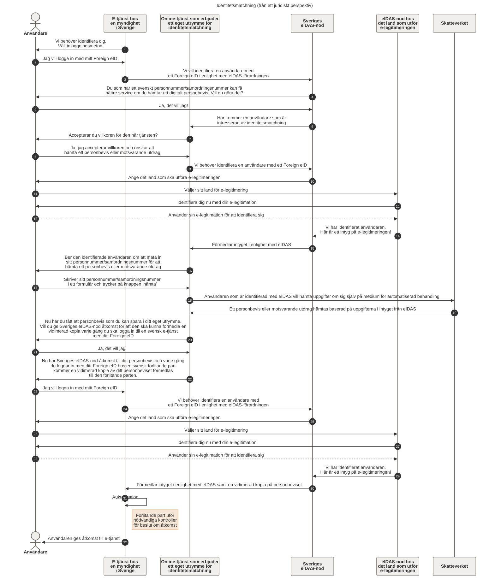

## Ett första utkast
Konceptuell modell

```mermaid
%%{init: {'sequence': { 'mirrorActors': true, 'rightAngles': true, 'messageAlign': 'center', 'actorFontWeight': 900, 'actorFontSize': 18, 'noteFontWeight': 100, 'noteFontSize': 12}}}%%
%%{init: {'theme': 'base', 'themeVariables': {'labelBoxBkgColor': '#F5F5F4', 'labelBoxBorderColor': '#998980', 'actorBorder': '#696059', 'actorBkg': '#F1EFEC', 'activationBorderColor': '#CD796E', 'activationBkgColor': '#CD796E', 'noteBkgColor': '#F5E6D7', 'noteBorderColor': '#CE8036'}}}%%


sequenceDiagram
    autonumber
    title: Identitetsmatchning (från ett juridiskt perspektiv)
    actor U as Användare
    participant RP as E-tjänst hos<br />en myndighet<br />i Sverige
    participant IDM as Online-tjänst som erbjuder<br />ett eget utrymme för<br />identitetsmatchning
    participant N as Sveriges<br />eIDAS-nod
    participant eID as eIDAS-nod hos<br />det land som utför<br />e-legitimeringen
    participant SV as Skatteverket
    RP->>U: Vi behöver identifiera dig.<br />Välj inloggningsmetod.
    U->>RP: Jag vill logga in med mitt Foreign eID
    RP->>N: Vi vill identifiera en användare med<br />ett Foreign eID i enlighet med eIDAS-förordningen
    N->>U: Du som har ett svenskt personnummer/samordningsnummer kan få<br />bättre service om du hämtar ett digitalt personbevis. Vill du göra det? 
    U->>N: Ja, det vill jag!
    N->>IDM: Här kommer en användare som är<br />intresserad av identitetsmatchning
    IDM->>U: Accepterar du villkoren för den här tjänsten?
    U->>IDM: Ja, jag accepterar villkoren och önskar att<br />hämta ett personbevis eller motsvarande utdrag
    IDM->>N: Vi behöver identifiera en användare med ett Foreign eID
    N->>U: Ange det land som ska utföra e-legitimeringen
    U->>eID: Väljer sitt land för e-legitimering
    eID->>U: Identifiera dig nu med din e-legitimation
    U-->>eID: Använder sin e-legitimation för att identifiera sig
    eID->>N: Vi har identifierat användaren.<br />Här är ett intyg på e-legitimeringen! 
    N->>IDM: Förmedlar intyget i enlighet med eIDAS
    IDM->>U: Ber den identifierade användaren om att mata in<br />sitt personnummer/samordningsnummer för att<br />hämta ett personbevis eller motsvarande utdrag 
    U->>IDM: Skriver sitt personnummer/samordningsnummer<br />i ett formulär och trycker på knappen 'hämta'
    IDM->>SV: Användaren som är identifierad med eIDAS vill hämta uppgifter om sig själv på medium för automatiserad behandling
    SV->>IDM: Ett personbevis eller motsvarande utdrag hämtas baserad på uppgifterna i intyget från eIDAS
    IDM->>U: Nu har du fått ett personbevis som du kan spara i ditt eget utrymme.<br />Vill du ge Sveriges eIDAS-nod åtkomst för att den ska kunna förmedla en<br />vidimerad kopia varje gång du ska logga in till en svensk e-tjänst<br />med ditt Foreign eID
    U->>IDM: Ja, det vill jag!
    IDM->>U: Nu har Sveriges eIDAS-nod åtkomst till ditt personbevis och varje gång<br />du loggar in med ditt Foreign eID hos en svensk förlitande part<br />kommer en vidimerad kopia av ditt personbeviset förmedlas<br />till den förlitande parten.
    U->>RP: Jag vill logga in med mitt Foreign eID
    RP->>N: Vi behöver identifiera en användare med<br />ett Foreign eID i enlighet med eIDAS-förordningen
    N->>U: Ange det land som ska utföra e-legitimeringen
    U->>eID: Väljer sitt land för e-legitimering
    eID->>U: Identifiera dig nu med din e-legitimation
    U-->>eID: Använder sin e-legitimation för att identifiera sig
    eID->>N: Vi har identifierat användaren.<br />Här är ett intyg på e-legitimeringen! 
    N->>RP: Förmedlar intyget i enlighet med eIDAS samt en vidimerad kopia på personbeviset
    RP->>RP: Auktorisation
    Note right of RP: Förlitande part uför<br />nödvändiga kontroller<br />för beslut om åtkomst
    destroy U
    RP->>U: Användaren ges åtkomst till e-tjänst

  
```

