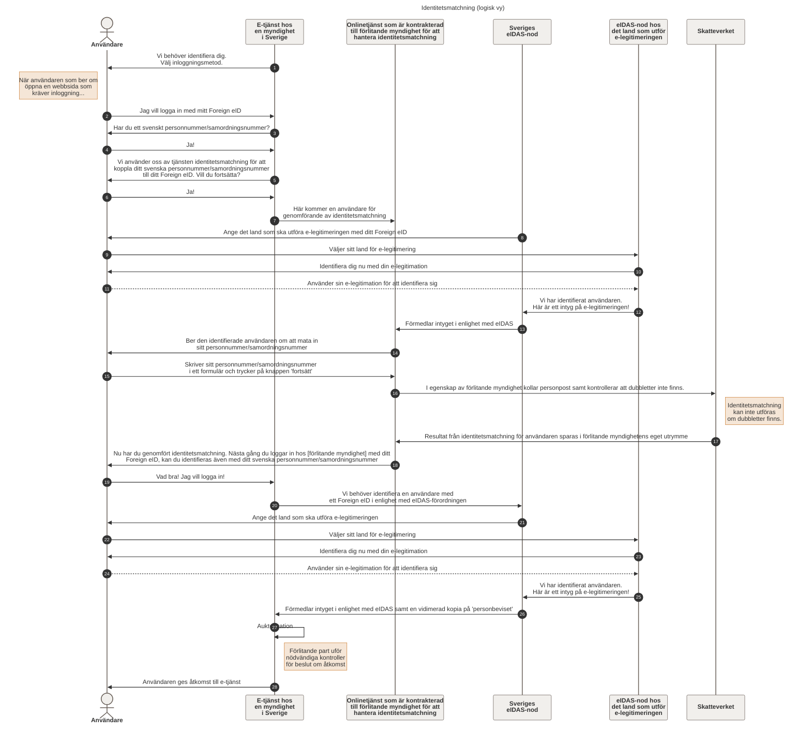

## Förlitande myndighet utkontrakterar kontroller
Konceptuell modell

```mermaid
%%{init: {'sequence': { 'mirrorActors': true, 'rightAngles': true, 'messageAlign': 'center', 'actorFontWeight': 900, 'actorFontSize': 18, 'noteFontWeight': 100, 'noteFontSize': 12}}}%%
%%{init: {'theme': 'base', 'themeVariables': {'labelBoxBkgColor': '#F5F5F4', 'labelBoxBorderColor': '#998980', 'actorBorder': '#696059', 'actorBkg': '#F1EFEC', 'activationBorderColor': '#CD796E', 'activationBkgColor': '#CD796E', 'noteBkgColor': '#F5E6D7', 'noteBorderColor': '#CE8036'}}}%%


sequenceDiagram
    autonumber
    title: Identitetsmatchning (logisk vy)    
    actor U as Användare
    participant RP as E-tjänst hos<br />en myndighet<br />i Sverige
    participant IDM as Onlinetjänst som är kontrakterad<br />till förlitande myndighet för att<br />hantera identitetsmatchning
    participant N as Sveriges<br />eIDAS-nod
    participant eID as eIDAS-nod hos<br />det land som utför<br />e-legitimeringen
    participant SV as Skatteverket
    RP->>U: Vi behöver identifiera dig.<br />Välj inloggningsmetod.
    Note left of U: När användaren som ber om<br />öppna en webbsida som<br />kräver inloggning...
    U->>RP: Jag vill logga in med mitt Foreign eID
    RP->>U: Har du ett svenskt personnummer/samordningsnummer? 
    U->>RP: Ja!
    RP->>U: Vi använder oss av tjänsten identitetsmatchning för att<br />koppla ditt svenska personnummer/samordningsnummer<br />till ditt Foreign eID. Vill du fortsätta?
    U->>RP: Ja!
    RP->>IDM: Här kommer en användare för<br />genomförande av identitetsmatchning
    N->>U: Ange det land som ska utföra e-legitimeringen med ditt Foreign eID
    U->>eID: Väljer sitt land för e-legitimering
    eID->>U: Identifiera dig nu med din e-legitimation
    U-->>eID: Använder sin e-legitimation för att identifiera sig
    eID->>N: Vi har identifierat användaren.<br />Här är ett intyg på e-legitimeringen! 
    N->>IDM: Förmedlar intyget i enlighet med eIDAS
    IDM->>U: Ber den identifierade användaren om att mata in<br />sitt personnummer/samordningsnummer 
    U->>IDM: Skriver sitt personnummer/samordningsnummer<br />i ett formulär och trycker på knappen 'fortsätt'
    IDM->>SV: I egenskap av förlitande myndighet kollar personpost samt kontrollerar att dubbletter inte finns. 
    Note right of SV: Identitetsmatchning<br />kan inte utföras<br />om dubbletter finns. 
    SV->>IDM: Resultat från identitetsmatchning för användaren sparas i förlitande myndighetens eget utrymme
    IDM->>U: Nu har du genomfört identitetsmatchning. Nästa gång du loggar in hos [förlitande myndighet] med ditt<br />Foreign eID, kan du identifieras även med ditt svenska personnummer/samordningsnummer
    U->>RP: Vad bra! Jag vill logga in!
    RP->>N: Vi behöver identifiera en användare med<br />ett Foreign eID i enlighet med eIDAS-förordningen
    N->>U: Ange det land som ska utföra e-legitimeringen
    U->>eID: Väljer sitt land för e-legitimering
    eID->>U: Identifiera dig nu med din e-legitimation
    U-->>eID: Använder sin e-legitimation för att identifiera sig
    eID->>N: Vi har identifierat användaren.<br />Här är ett intyg på e-legitimeringen! 
    N->>RP: Förmedlar intyget i enlighet med eIDAS samt en vidimerad kopia på 'personbeviset'
    RP->>RP: Auktorisation
    Note right of RP: Förlitande part uför<br />nödvändiga kontroller<br />för beslut om åtkomst
    RP->>U: Användaren ges åtkomst till e-tjänst

```
