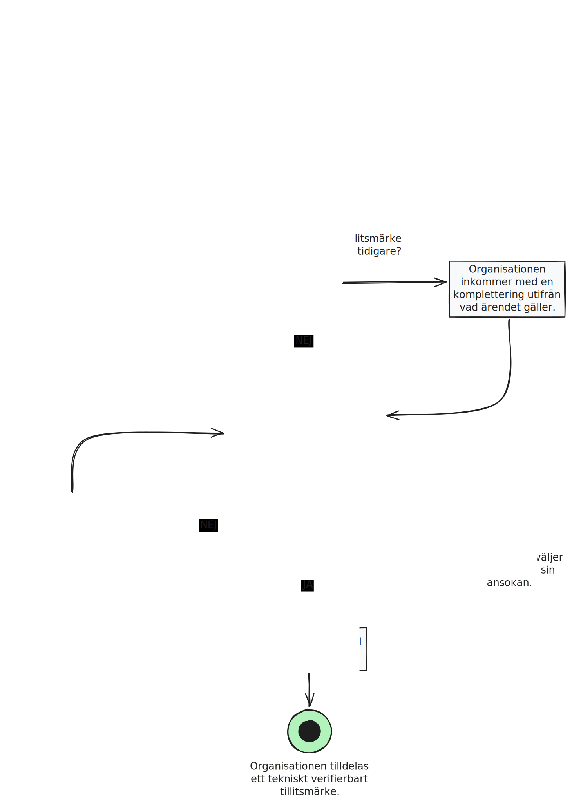

# Anskaffa tillitsmärke
:pushpin: **Processbeskrivning**  
Organisation som har en tjänst ansluten till den federativa infrastrukturen anskaffar tillitsmärke för sin tjänst.

:white_circle: **Start**  
Organisation ansöker om medlemskap till den federativa infrastrukturen för identitets- och behörighetshantering inom ramen för Ena (Sveriges digitala infrastruktur).

:black_circle: **Slut**  
Organisation är medelm i den federativa infrastrukturen.

:bookmark_tabs: **Önskat resultat**  
Operatören kan i enlighet med anslutningsreglerna registrera en kontaktperson som blir huvudkontakt att företräda organisationen.    

  
